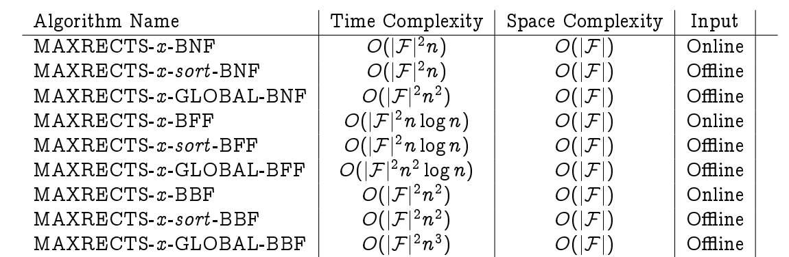

# 基于人工智能的雪碧图拼接算法

**keywords:** `bin-pack` `image-pack` `max-rect` `genetic` `typescript` `javascript` `node.js` `image-resource` `ai`

## 算法

**算法分为两层**

1.  底层是基于 `max-rect-bin-pack` 的 `Rectangle Bin Pack` 算法
2.  上层是基于 遗传算法 的最优化的搜索算法。

**FYI:** 底层算法分为`在线`和`离线`两种模式: 离线算法有一定的优化方案，所以离线算法效果更好。上层的遗传算法强制调用了离线算法。

**算法的复杂度**

1.  底层 `max-rect-bin-pack` 算法



在线算法虽然效率更高，但是在线算法结果没有离线算法结果好。

2.  上层 遗传算法

遗传算法的时间空间复杂参考[paper](https://pdfs.semanticscholar.org/18e1/03c600134d55a4ef084f11bee045b8505cf7.pdf?_ga=2.45871975.213758763.1529380129-1889820781.1529380129)。

大致上可以认为和种群中孩子个数和生态个数成正相关。

## API & demo

1.  FindPosition

寻找矩形位置的五种策略。

```typescript
enum FindPosition {
  ShortSideFit = 0,
  BottomLeft,
  ContactPoint,
  LongSideFit,
  AreaFit,
}
```

2.  Rect

```javascript
const rect = new Rect();
rect.width = 90;
rect.height = 90;
```

3.  `max-rect-bin-pack` 调用

```javascript
import { MaxRectBinPack, Rect } from 'name';
const width = 200;
const height = 200;
const allowRotate = true;
const packer = MaxRectBinPack(width, height, allowRotate);

const findPosition = 0; // 参照第一条

// 在线算法 尽量不要使用
for(const rect of rects){
  const result = packer.insert(rect.width, rect.height, findPosition);
  if(result.width!==rect.width||result.height!==rect.height){ // 插入失败返回一个宽高为0的Rect
    throw new Error('insert failed');
  }else{
    console.log(result.x, result.y, result.widht, result.height); // 插入成功
  }
}

//离线算法 推荐使用
const rects: Rect[] = [];
const rectsCopy = rects.map($=>$.clone());// js引用传递，这里直接操纵了传入的数组，所以传入一份clone的。
const result = packer.insertRects(rectsCopy, findPosition);
if(result.length!==rects.length){ // 插入失败，因为容器大小不足
  throw new Error('insert failed');
}else{ //插入成功
  result.forEach(rect => {
    console.log(rect.x, rect.y, rect.width, rect.height);
  });
}
```

4.  `genetic` 遗传算法 调用

```typescript
import { MaxRectBinPack, Rect, genetic } from '';
const rects: Rect[] = [];

const findPosition = 0; // 参照第一条

const bestSize = genetic(rects, { // 遗传算法确定最优策略
  findPosition: findPosition,
  lifeTimes: 50, // 代数
  liveRate: 0.5, // 存活率
  size: 50, // 每一代孩子个数
});

const width = bestSize.x;
const height = bestSize.y;
const packer = new MaxRectBinPack(width, height, true);
const result = packer.insertRects(rects, findPosition);
console.log(result.length === /* rects.length */);
```

## TODO

- [ ] 基因编码策略升级
- [ ] 返回结果优化
